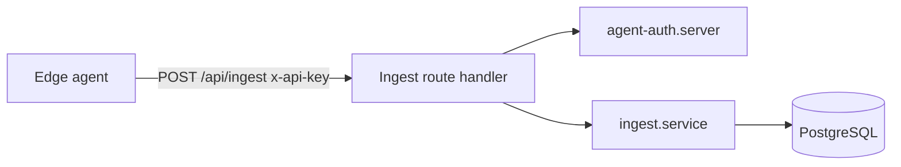

# Architecture map

## Stack (this repo)

- **Runtime**: Node-compatible; **Bun** is used for scripts, dev server, tests, and production `server.ts` on Zerops.
- **App framework**: **TanStack Start** (Vite 7, SSR) with **TanStack Router** file-based routes under `src/routes/`.
- **Data**: **PostgreSQL** via **Prisma 7** with `@prisma/adapter-pg`; client generated to `generated/prisma/`.
- **Validation**: **Zod** (ingest payload).
- **Styling**: **Tailwind CSS v4** (`@tailwindcss/vite`), global tokens in `src/styles.css`.

## High-level flow

- **Health**: plain text `ok` for probes — see `src/routes/health.ts` and `src/features/health/`.
- **Ingest**: JSON body validated with Zod; agent resolved by hashed API key; transactional write of `RawReport`, `Device`, `Observation`, optional `Alert`.

## Directory layout

| Path | Role |
| --- | --- |
| `src/routes/` | TanStack file routes; thin wiring to handlers where used |
| `src/features/<name>/` | Domain logic: `*.service.ts`, `*.schema.ts`, `*.route-handler.ts`, tests |
| `src/lib/` | Shared server utilities (e.g. Prisma) |
| `src/components/` | React UI components |
| `prisma/` | Schema, migrations, seed |
| `generated/prisma/` | Prisma client output (generated; do not hand-edit) |
| `server.ts` | Production Bun server: static files from `dist/client`, then SSR `dist/server/server.js` |

## Import alias

- `#/*` → `./src/*` (see `package.json` `"imports"`).

## Route generation

- `src/routeTree.gen.ts` is generated by TanStack Router; regen via dev/build tooling, not manual edits for structure.
